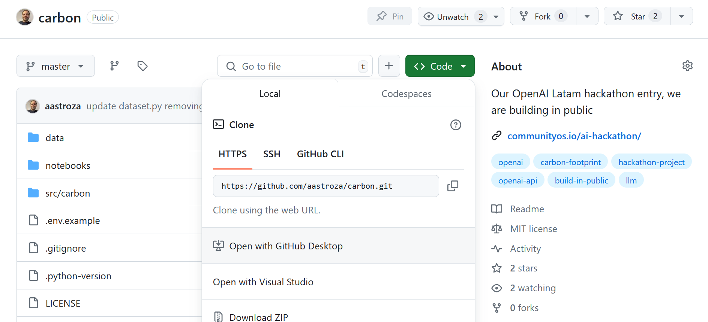
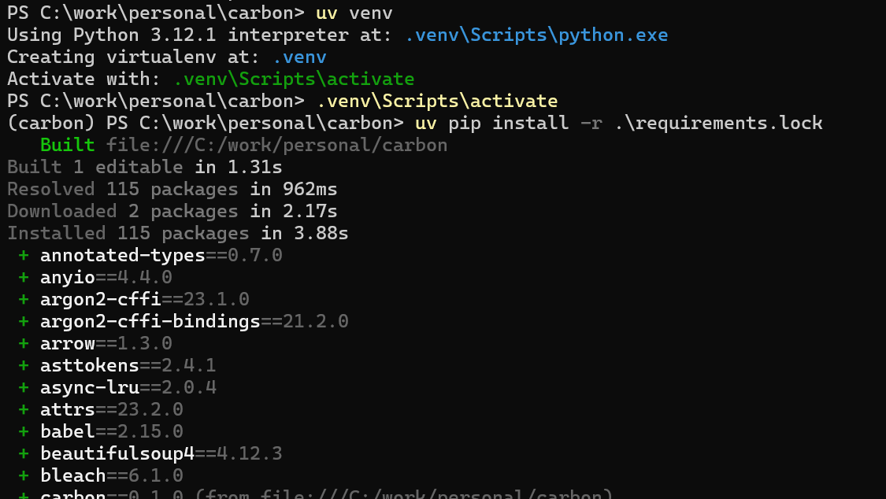
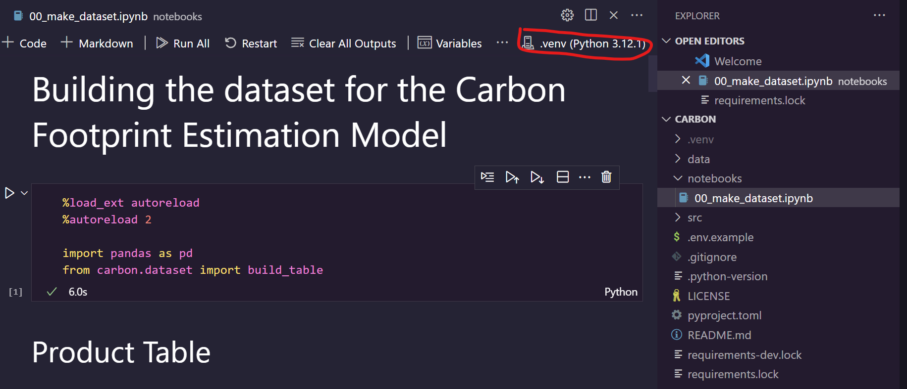

# Installation Guide

## Clone the repository

To clone the repository, click the green "Code" button on the GitHub repository page.



I recommend using [GitHub Desktop](https://github.com/apps/desktop), which provides a user-friendly graphical interface for managing repositories.


## Create a .venv

- Install [uv](https://github.com/astral-sh/uv) if you haven't already.
- Navigate to the folder where you cloned the repository.
- Create a virtual environment and activate it with the following commands:

```shell
uv venv
.venv\Scripts\activate
```
You should see the following output on your screen:



## Install Required Libraries

To install the necessary libraries, run the following command:

```shell
uv pip install -r requirements.lock
```

## Run the Jupyter Notebook

- Open your cloned repository folder in [VSCode](https://code.visualstudio.com/).
- Navigate to the `notebooks` folder and open the Jupyter Notebook file.
- In the top-right corner, you’ll see a button labeled *"Select Kernel"*. Choose the local Python virtual environment you created earlier.
- You are now ready to execute the code in the notebook.

